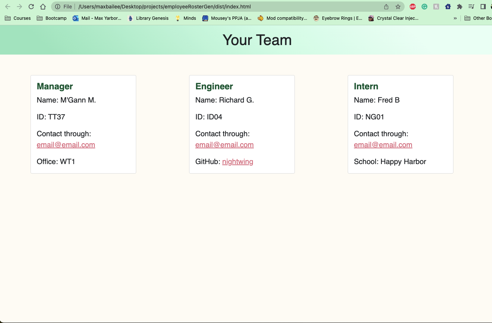

# Employee Roster Generator
## Week 10 Challenge

For this week's challenge, we were to build a Employee Roster generator using Node and Inquirer. We did this in order to strengthen our skills with JS classes and constructor functions. 

In order to finish this assignment, I utilized techniques I learned from Module 9 and Module 10. Meaning, I was able to use Inquirer to capture user input and take that input to generate a site using my HTML template. I created classes for each employee type and implemented inhieritance to shorten my code. Throughout the week , I helped and was helped by my classmates in order to practice collaboration. And in the end, my site 'Your Team' made me one step closer to becoming a full-stack engineer.

🤓 Built with:
- JavaScript
    - ES6
- Node
    - Inquirer
    - fs
- HTML
- CSS
    - Bootstrap
    - Google Fonts

### Preview ✨
You can find a walkthrough on my YouTube [here.](https://www.youtube.com/watch?v=QQmWYdkzsnw)

Or, you can clone this repo down and run the app yourself using node and a terminal!

#### Credits 💖

In collaboration with:
My lovely classmates. 🥹

Scenario and instruction provided by UTSA's Coding Bootcamp. 
